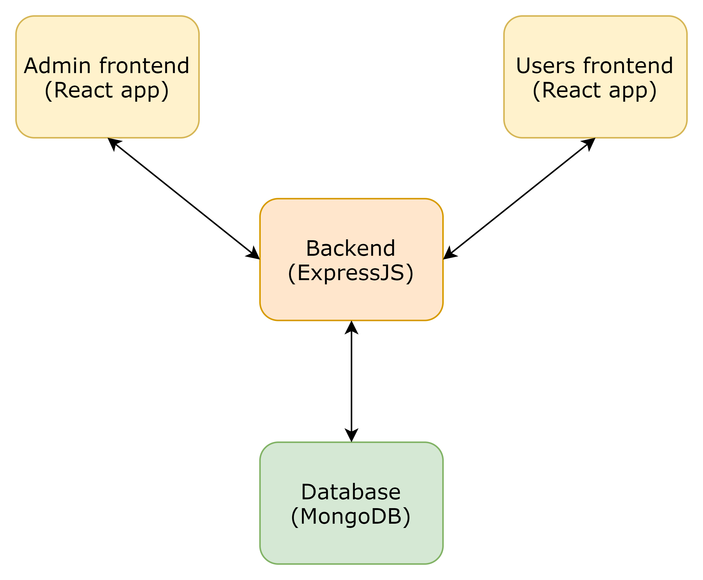

# Example App (Cloud mini project)

A simple distributed application running across multiple Docker containers.

## Getting started

Download [Docker Desktop](https://www.docker.com/products/docker-desktop) for Mac or Windows. [Docker Compose](https://docs.docker.com/compose) will be automatically installed. On Linux, make sure you have the latest version of [Compose](https://docs.docker.com/compose/install/).

## Linux Containers

The Linux stack uses Node.js and MongoDB for storage.

> If you're using [Docker Desktop on Windows](https://store.docker.com/editions/community/docker-ce-desktop-windows), you can run the Linux version by [switching to Linux containers](https://docs.docker.com/docker-for-windows/#switch-between-windows-and-linux-containers), or run the Windows containers version.

Run in this directory:

```
docker-compose build
```

```
docker-compose up
```

The admin dashboard will be running at [http://localhost:3002](http://localhost:3002), backend APIs will be served from
[http://localhost:3001](http://localhost:3001) and the players will be able to login at [http://localhost:3000](http://localhost:3000).

## Architecture



- A front-end web app written in [React](/admin) which lets you control the admin dashboard after authentication.
- Another front-end web app written in [React](/users) which lets you participate in the quiz game after authentication.
- An [expressJS](/backend) backend that provides the REST APIs.
- A [MongoDB](https://en.wikipedia.org/wiki/MongoDB) database backed by a Docker volume

## Note

Prime focus of this project is containerization of different apps and their orchestration using docker-compose.